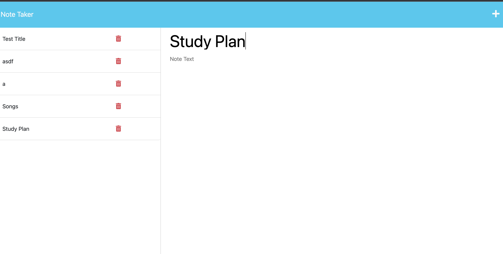

# Note Taker

## Table of Contents

- [Description of the Project](#description)
- [Installation](#installation)
- [Screenshot](#screenshot)
- [Links](#links)
- [License](#license)

## Description

This is an application called Note Taker that can be used to write and save notes using Express.js.

## Installation

Needs to install Express.js

## Screenshot

## Links

-
-

## License

This project is licensed under the terms of the MIT license.
[License](https://opensource.org/licenses/MIT)
